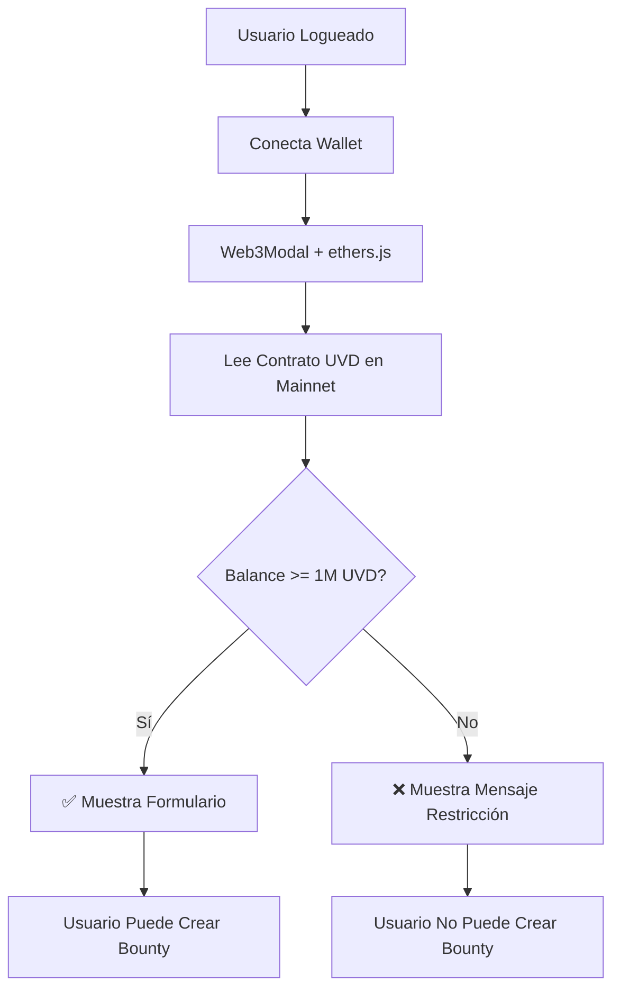

# ✅ Configuración de Whitelist UVD - COMPLETADA

## 🎯 Resumen de Configuración

El sistema de whitelist ha sido configurado exitosamente para el token **UVD (UltraVioleta DAO)**.

### Datos del Token UVD

| Propiedad | Valor |
|-----------|-------|
| **Nombre** | UltraVioleta DAO |
| **Símbolo** | UVD |
| **Contrato** | `0x4Ffe7e01832243e03668E090706F17726c26d6B2` |
| **Balance Mínimo** | 1,000,000 UVD |
| **Red** | Ethereum Mainnet (Chain ID: 1) |
| **Tipo** | ERC-20 |

## 📋 Configuración Aplicada

### Archivo: `src/utils/tokenValidation.js`

```javascript
export const WHITELIST_CONFIG = {
  GOVERNANCE_TOKEN: {
    address: '0x4Ffe7e01832243e03668E090706F17726c26d6B2',
    minBalance: 1000000, // 1,000,000 UVD
    name: 'UltraVioleta DAO',
    symbol: 'UVD'
  },
  validationType: 'token'
};
```

## 🔍 Cómo Funciona la Validación

### 1. Usuario Hace Login
El usuario primero debe autenticarse en la plataforma.

### 2. Usuario Conecta Wallet
Al hacer clic en "Conectar Wallet", se abre Web3Modal que permite conectar:
- MetaMask
- Rabby Wallet
- WalletConnect
- Otras wallets Web3

### 3. Verificación Automática de Balance
Una vez conectada la wallet, el sistema automáticamente:

```javascript
1. Lee el contrato UVD en Ethereum Mainnet
2. Consulta el balance de tokens UVD de la wallet conectada
3. Compara el balance con el requisito (1,000,000 UVD)
4. Muestra el resultado al usuario
```

### 4. Resultados Posibles

#### ✅ Acceso Concedido (Balance ≥ 1,000,000 UVD)
```
┌────────────────────────────────────┐
│ ✓ ¡Acceso Verificado!              │
│ Balance: 1,500,000.00 UVD          │
├────────────────────────────────────┤
│                                    │
│  [Formulario de Creación]          │
│  Título: _______________           │
│  Descripción: __________           │
│  Recompensa: ___________           │
│  Fecha: ________________           │
│                                    │
│  [Crear Bounty]                    │
└────────────────────────────────────┘
```

#### ❌ Acceso Denegado (Balance < 1,000,000 UVD)
```
┌────────────────────────────────────┐
│         [X Rojo]                   │
│                                    │
│     Acceso Restringido             │
│                                    │
│ Tu wallet no cumple con los        │
│ requisitos para crear bounties     │
│                                    │
│ Requisito: 1,000,000 UVD           │
│ Tu balance: 500,000 UVD            │
└────────────────────────────────────┘
```

## 🎨 Ejemplos de Casos de Uso

### Caso 1: Usuario con Suficientes Tokens
```
Usuario: 0x1234...5678
Balance UVD: 2,500,000 UVD
Requisito: 1,000,000 UVD
Resultado: ✅ ACCESO CONCEDIDO
```

### Caso 2: Usuario sin Suficientes Tokens
```
Usuario: 0xabcd...ef01
Balance UVD: 500,000 UVD
Requisito: 1,000,000 UVD
Resultado: ❌ ACCESO DENEGADO
```

### Caso 3: Usuario sin Tokens
```
Usuario: 0x9876...5432
Balance UVD: 0 UVD
Requisito: 1,000,000 UVD
Resultado: ❌ ACCESO DENEGADO
```

## 📊 Flujo Técnico



## 🔧 Funciones Implementadas

### `validateWhitelist(walletAddress, provider)`
Función principal que valida el acceso.

**Entrada:**
- `walletAddress`: Dirección de la wallet conectada
- `provider`: Provider de ethers.js

**Salida:**
```javascript
{
  isWhitelisted: true/false,
  details: {
    type: 'token',
    tokenName: 'UVD',
    balance: '1500000.00',
    minRequired: 1000000,
    error: null
  }
}
```

### `checkTokenBalance(walletAddress, tokenAddress, provider, minBalance)`
Verifica el balance de tokens ERC20.

**Características:**
- ✅ Lectura sin gas (view function)
- ✅ Soporte para cualquier token ERC20
- ✅ Manejo de decimales automático
- ✅ Formato legible para humanos

## 🚀 Deployment

### Checklist de Producción

- [x] ✅ Dirección del contrato UVD configurada
- [x] ✅ Balance mínimo configurado (1,000,000 UVD)
- [x] ✅ Validación en frontend implementada
- [x] ✅ Mensajes de error claros
- [x] ✅ UI/UX para diferentes estados
- [x] ✅ Traducciones en inglés y español

### Recomendaciones Adicionales

1. **Validación Backend (Opcional pero Recomendado)**
   ```javascript
   // En server/routes/bounties.js
   const validateUVDBalance = async (walletAddress) => {
     const provider = new ethers.providers.JsonRpcProvider(MAINNET_RPC);
     const contract = new ethers.Contract(UVD_ADDRESS, ABI, provider);
     const balance = await contract.balanceOf(walletAddress);
     return balance.gte(ethers.utils.parseUnits('1000000', 18));
   };
   ```

2. **Cache de Validaciones**
   - Cachear resultados por 5-10 minutos
   - Reducir llamadas a la blockchain
   - Mejorar experiencia de usuario

3. **Monitoreo**
   - Log de intentos de acceso
   - Métricas de usuarios whitelisted vs no-whitelisted
   - Alertas si el contrato no responde

## 🧪 Testing

### Manual Testing

1. **Caso 1: Usuario con Tokens**
   ```bash
   1. Hacer login en la plataforma
   2. Conectar wallet con > 1M UVD
   3. Verificar mensaje de "Acceso Verificado"
   4. Verificar que formulario esté visible
   ```

2. **Caso 2: Usuario sin Tokens**
   ```bash
   1. Hacer login en la plataforma
   2. Conectar wallet con < 1M UVD
   3. Verificar mensaje de "Acceso Restringido"
   4. Verificar que balance actual se muestre
   ```

3. **Caso 3: Error de Red**
   ```bash
   1. Desconectar internet brevemente
   2. Intentar conectar wallet
   3. Verificar mensaje de error apropiado
   ```

### Automated Testing

```javascript
// Ejemplo de test con Jest
describe('UVD Whitelist Validation', () => {
  test('should grant access with 1M+ UVD', async () => {
    const mockProvider = createMockProvider();
    const mockAddress = '0x1234...';
    
    // Mock balance: 2,000,000 UVD
    mockBalanceOf.mockResolvedValue(
      ethers.utils.parseUnits('2000000', 18)
    );
    
    const result = await validateWhitelist(mockAddress, mockProvider);
    
    expect(result.isWhitelisted).toBe(true);
    expect(parseFloat(result.details.balance)).toBeGreaterThan(1000000);
  });
  
  test('should deny access with < 1M UVD', async () => {
    // Similar test for denial case
  });
});
```

## 📈 Métricas Recomendadas

Considera trackear:
- Total de intentos de conexión
- Usuarios que cumplen requisito vs los que no
- Balance promedio de usuarios que intentan crear bounties
- Errores de validación más comunes

## 🔒 Seguridad

### Frontend (Implementado)
✅ Validación antes de mostrar formulario  
✅ Lectura de blockchain sin permisos especiales  
✅ No requiere firmas del usuario  
✅ Sin acceso a claves privadas  

### Backend (Recomendado)
⚠️ Agregar validación server-side  
⚠️ Verificar firma de transacciones  
⚠️ Rate limiting en endpoints  
⚠️ Log de actividad sospechosa  

## 🆘 Troubleshooting

### Problema: "Error al verificar el token"

**Posibles causas:**
1. Wallet en red incorrecta (debe estar en Mainnet)
2. RPC no responde
3. Contrato no válido

**Solución:**
```javascript
// Verificar red actual
const network = await provider.getNetwork();
console.log('Red actual:', network.chainId); // Debe ser 1 (Mainnet)

// Cambiar a Mainnet si es necesario
if (network.chainId !== 1) {
  await window.ethereum.request({
    method: 'wallet_switchEthereumChain',
    params: [{ chainId: '0x1' }]
  });
}
```

### Problema: Balance incorrecto mostrado

**Verificación:**
```javascript
// Verificar decimales del token
const decimals = await contract.decimals();
console.log('Decimales UVD:', decimals);

// Formato correcto
const balanceFormatted = ethers.utils.formatUnits(balance, decimals);
```

### Problema: Validación muy lenta

**Optimizaciones:**
1. Usar RPC más rápido (Infura, Alchemy, Ankr)
2. Implementar cache de validaciones
3. Agregar loading states más claros

## 📞 Información de Contacto

- **Contrato UVD**: `0x4Ffe7e01832243e03668E090706F17726c26d6B2`
- **Verificar en Etherscan**: [Ver Contrato](https://etherscan.io/token/0x4Ffe7e01832243e03668E090706F17726c26d6B2)
- **Red**: Ethereum Mainnet
- **Requisito Actual**: 1,000,000 UVD

---

**Fecha de Configuración**: Octubre 2025  
**Estado**: ✅ ACTIVO Y FUNCIONANDO  
**Última Actualización**: Este documento

