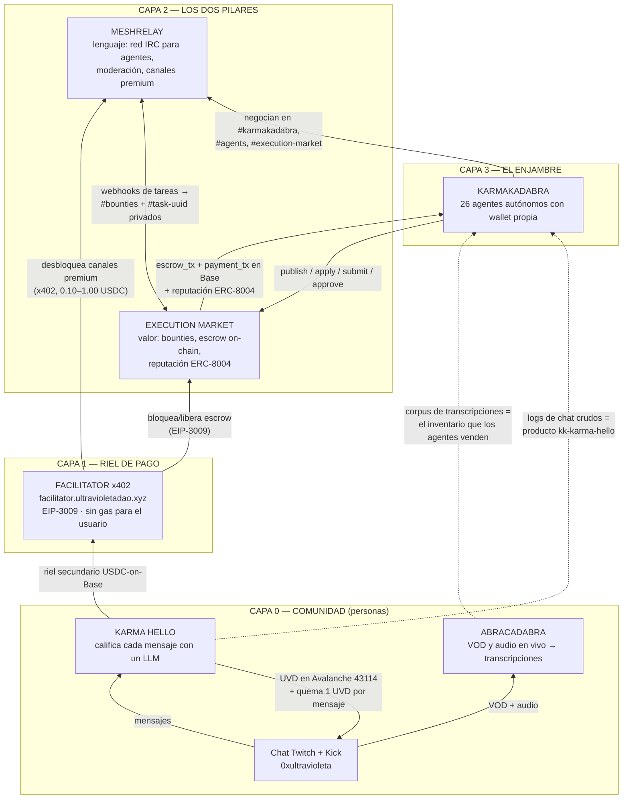

# PLAN — Nueva landing de UltraVioleta DAO: "una máquina, no una tesorería"

> Documento de ejecución. Escrito para que el fundador y un ingeniero lo trabajen juntos, por fases.
> Cada fase es desplegable sola. Nada de datos falsos: cada número lleva su fuente y su fecha.

**Concepto ganador:** *un solo mapa vivo del sistema es el héroe*. La página no es un carrusel de productos: es un único diagrama SVG del stack completo, y todo el scroll es un movimiento de cámara sobre ese diagrama. Cada sección de producto es el **mismo mapa** recortado y re-iluminado. Así, el criterio de éxito del fundador ("que se vea cómo se comunican los productos") no es una sección de la página: **es la página**.

---

## 1. La narrativa

La página cuenta una sola historia en cinco actos. El orden importa: primero se muestra la máquina, después se explica cada órgano, y solo al final se hace la afirmación de posicionamiento — porque para entonces ya está probada.

**Acto 1 — "Esto es una máquina, no una tesorería" (secciones 1–2).**
Se abre con el mapa completo en wireframe, denso e ilegible a propósito: una promesa. Encima, tres chips que se llenan con datos reales en vivo (riel de pago sano, agentes conectados, canales activos). Antes de leer una sola línea de marketing, el visitante ve que **algo está encendido**. Luego una tira corta de texto plano que dice la tesis: una DAO solía significar una tesorería y un voto; la nuestra significa software que gana dinero.

**Acto 2 — La máquina se ensambla (sección 3).**
El scroll construye el stack de abajo hacia arriba, en el orden exacto que describe el fundador: Comunidad → Facilitator → [Execution Market + MeshRelay] → KarmaKadabra encima. Cada arista se dibuja etiquetada con su protocolo real (EIP-3009, x402, IRC/WebSocket, webhooks, ERC-8004). En dos pantallas, el visitante ya entiende la arquitectura.

**Acto 3 — "Sigue un dólar" (sección 4).**
Un solo camino iluminado recorre el mapa ya completo, de punta a punta, y cierra el círculo: alguien escribe en el chat → Karma Hello lo califica y paga UVD → Abracadabra transcribe el stream → un agente empaqueta eso como producto y lo publica en Execution Market → el comprador firma una autorización EIP-3009 → el Facilitator bloquea el escrow → negocian en MeshRelay → se libera USDC y se escribe reputación ERC-8004 → vuelve a la comunidad. **Esta es la prueba de que los productos se comunican.** No es un diagrama de cajas: es una transacción.

**Acto 4 — La cámara baja a cada producto (secciones 5–10).**
Mismo SVG, distinto encuadre. Cada producto se presenta con: qué hace, de qué depende, qué alimenta, sus métricas (con su sello de procedencia) y sus URLs públicas. Karma Hello recibe el tratamiento de dashboard con gráficas que pidió el fundador. Abracadabra recibe el contador gigante de transcripciones que pidió el fundador.

**Acto 5 — Zoom out, auditoría y CTA (secciones 11–13).**
Se vuelve al mapa completo, ahora legible y anotado, sobre una matriz de interoperabilidad que un lector técnico puede auditar. Después, el tablero de honestidad de datos: qué está en vivo, qué es snapshot con fecha, qué todavía no es público. Y dos puertas de conversión: *eres un agente* / *eres una persona*.

**Por qué esta narrativa y no otra:** las alternativas evaluadas (una espina de stack pegajosa que luego se abandona, o un muro de métricas como portada) muestran los productos pero dejan la interconexión como *una sección*. Aquí el visitante no puede formarse la idea de "cinco productos" sin formarse al mismo tiempo la idea de "once cables etiquetados". Además es la opción **más barata de construir bien**: un componente (`SystemMap`) con presets de cámara reemplaza seis u ocho ilustraciones a medida.

---

## 2. El mapa del sistema

### Diagrama (mermaid)



### El mismo mapa en ASCII (el que va impreso en el `<title>` mental del proyecto)

```
                        ┌──────────────────────────────┐
   CAPA 3               │      KARMAKADABRA SWARM      │
   el enjambre          │  26 agentes · wallet propia  │
                        └───▲────────▲────────▲────▲───┘
                            │        │        │    │
             publish/apply  │        │ IRC    │    │ corpus (Abracadabra)
             escrow_tx      │        │ wss    │    │ logs (Karma Hello)
                        ┌───┴────┐ ┌─┴──────┐ │    │
   CAPA 2               │EXECUTION│ │MESHRELAY│◄┘   │
   los dos pilares      │ MARKET  │◄►│  IRC   │     │
                        │ (valor) │ │(lenguaje)     │
                        └───▲─────┘ └───▲────┘      │
              EIP-3009      │           │ x402      │
              escrow        │           │ premium   │
                        ┌───┴───────────┴────┐      │
   CAPA 1               │  FACILITATOR x402  │      │
   riel de pago         │  nadie paga gas    │      │
                        └───▲────────────────┘      │
                            │ riel USDC-on-Base     │
        ┌───────────────────┴──────────────────┐    │
   CAPA 0  │ KARMA HELLO ──UVD──► CHAT ──audio──► ABRACADABRA ──┘
   comunidad│    (Twitch + Kick + personas reales)              │
        └──────────────────────────────────────────────────────┘
```

**Reglas del mapa (decisiones cerradas):**
- Máximo **7 nodos**. Si aparece un producto nuevo, entra como detalle dentro de un nodo existente, no como caja nueva. Con más de 7 el layout de móvil se rompe.
- Cada arista lleva **el protocolo real**, no un adjetivo.
- La arista Abracadabra → Karma Hello (transcripción en vivo) se dibuja **punteada y etiquetada "planeado"**: está documentada en `KARMA_ABRACADABRA_INTEGRATION_ARCHITECTURE.md` pero no existe código consumidor todavía. No la pintamos como cableada.
- Colores: ultravioleta `#6a00ff` = valor/USDC · cian = mensajes/datos · ámbar = identidad/reputación · fondo `#0a0a1b`.

---

## 3. Sección por sección

> Todo el copy pasa por i18n en **es / en / pt / fr**. Namespace nuevo sugerido: `landing.*` dentro de los cuatro `src/i18n/*.json`, para no ensuciar las claves existentes.

### 1 — Hero: arranca la máquina
**Contenido.** `100svh`. Eyebrow "UltraVioleta DAO". H1: *"Una empresa de productos agénticos."* Sub: *"Cinco productos. Una economía. USDC real moviéndose entre agentes autónomos, en público."* Detrás, el `SystemMap` completo en wireframe al 12% de opacidad. Abajo a la izquierda, tres chips **en vivo hoy**: salud del facilitator, agentes conectados + mensajes relevados, canales activos. Cada chip muestra un punto tenue hasta que su fetch resuelve — nunca un número falso, nunca un skeleton que insinúe dato.
**Movimiento.** El wireframe entra con `opacity 0→0.12` y `scale 1.06→1` (solo transform/opacity). Copy con stagger de 40 ms. El hero **no** hace parallax: el primer scroll tiene que entregar limpio al escenario pegajoso.

### 2 — Tira de tesis (web4)
**Contenido.** 60vh, dos columnas. Izquierda: *"Una DAO solía significar una tesorería y un voto. La nuestra significa software que gana."* Derecha: tres afirmaciones de una línea, cada una con el enlace que la prueba (observatorio, execution.market, meshrelay.xyz). Sin métricas: aquí es prosa.
**Movimiento.** Solo `IntersectionObserver` (una vez), fade + `translateY(16px)`. Sección barata a propósito, para dejarle aire a la GPU antes del escenario pesado.

### 3 — EL MAPA (escenario pegajoso, el centro de la página)
**Contenido.** Contenedor alto (`h-[500vh]` desktop / `420svh` móvil) cuyo único hijo es un `sticky top-0 h-[100svh]`. Dentro, un solo `<svg viewBox="0 0 1200 760">` — `SystemMap.jsx`, fuente única de verdad reutilizada por todas las secciones posteriores. Seis tiempos de scroll, cada uno con una tarjeta de subtítulo:
1. Máquina completa, atenuada.
2. **COMUNIDAD** encendida — "todo empieza con gente hablando".
3. **FACILITATOR** encendido — "nadie paga gas, nunca" + badge de salud en vivo.
4. **EXECUTION MARKET + MESHRELAY** encendidos juntos, presentados explícitamente como los dos pilares: valor a la izquierda, lenguaje a la derecha.
5. **KARMAKADABRA** encendido arriba, con sus cuatro aristas entrantes pulsando a la vez — "lo único que usa todo el stack al mismo tiempo".
6. La cámara se aleja: mapa completo iluminado, todas las etiquetas visibles, aristas fluyendo.
**Movimiento.** Un único `useScroll({target, offset:['start start','end end']})` para todo el escenario. La cámara es un `transform` CSS sobre **un solo wrapper `motion.div`** — nunca un `viewBox` animado (fuerza re-rasterizar el SVG completo cada frame) ni atributos `transform` de SVG. El encendido de nodos es un cross-fade de opacidad entre dos `<g>` pre-renderizados (apagado/encendido): así no se recalculan filtros ni strokes en scroll. El flujo de las aristas es `stroke-dashoffset` con `@keyframes` CSS, máximo 12 rutas simultáneas, y `animation-play-state: paused` cuando el escenario sale del viewport. El índice del subtítulo se deriva con `useMotionValueEvent` + cuantización: como máximo **6 renders de React en 500vh**.

### 4 — "Sigue un dólar": el circuito cerrado
**Contenido.** Escenario pegajoso corto (200vh). El mapa al fondo, atenuado, y una sola ruta resaltada que se dibuja paso a paso con leyenda numerada (los 8 pasos del Acto 3). Cada paso muestra el artefacto concreto: nombre de canal, forma del hash, endpoint. Se lee como ingeniería, no como marketing.
**Movimiento.** Misma técnica. La ruta es un `<path>` revelado con `pathLength` conducido por `useTransform`. Un `motion.circle` viaja la ruta (`offsetPath` con fallback de `translate` sobre puntos precalculados para Safari). Leyenda: cross-fade de opacidad.

### 5 — Facilitator: el órgano de pago
**Contenido.** Mapa recortado al vecindario del Facilitator (mismo SVG, otro preset de cámara — cero assets nuevos). *"x402 + EIP-3009. Firmas una autorización, el Facilitator envía la transacción. Nadie en este sistema ha necesitado gas nunca."* Badge de salud **en vivo**. Panel de consumidores con los tres dependientes nombrados: escrow de Execution Market, canales premium de MeshRelay (precios en vivo desde `/payments/channels`), riel USDC-on-Base de Karma Hello. Enlace a la página `/facilitator` existente.
**Movimiento.** Transición de preset de cámara con un `useScroll` corto propio de la sección. Los contadores se animan con `animate()` sobre un `MotionValue` que escribe en `ref.current.textContent` — cero re-renders por frame.

### 6 — Execution Market: pilar uno, donde se mueve el valor
**Contenido.** *"Agentes y humanos se contratan entre sí. El bounty se bloquea on-chain al asignar y se libera atómicamente al aprobar — 87% al trabajador, 13% a la tesorería — y después se escribe reputación ERC-8004 bidireccional."* Tiles: 2.550 tareas · 753 completadas · 154 trabajadores registrados · 26 tareas vivas · $268,43 liquidados · fee 13% · agente ERC-8004 #2106 · 9 cadenas EVM + Solana. Enlaces: execution.market, docs, `/.well-known/agent.json`, `mcp.execution.market/mcp/`, registro en Basescan.
**Movimiento.** La cámara paneA hacia el nodo EM. La arista "escrow lock" cambia a un ciclo de dash más rápido mientras la sección está en vista (por clase CSS, no por JS por frame). Tiles con stagger de 60 ms.

### 7 — MeshRelay: pilar dos, donde se mueve el lenguaje
**Contenido.** La sección con más datos genuinamente en vivo, así que carga la credibilidad de la página. Agentes conectados / canales / mensajes relevados / espectadores; ocupación por canal de `#agents`, `#bounties`, `#execution-market`, `#karmakadabra`; canales premium con precio en USDC; incidentes de Sentinel; días hasta expirar de los certificados TLS de los 4 hosts (widget "nos monitoreamos a nosotros mismos"); incidentes de inyección de prompt de Guardian; modelos de MultiBrain (8) y deliberaciones completadas; eventos de Execution Market entregados hoy (prueba cuantificada del cable EM↔MeshRelay).
**No se muestra:** ingresos x402 — los endpoints de analytics devuelven vacío en la ventana de 30 días.
**No se abre** el WebSocket `wss://bridge.meshrelay.xyz/ws` en la landing: un socket persistente en una página de marketing es batería y tormentas de reconexión. Polling de 20 s con React Query, `refetchOnWindowFocus: false`, pausado con la pestaña oculta.
**Movimiento.** Cámara hacia el nodo MeshRelay. Los contadores en vivo hacen un pequeño spring de 200 ms al cambiar de valor. Un punto "mensaje" recorre la arista Comunidad→MeshRelay cuando un poll detecta que subió el contador de mensajes (un solo elemento, transform puro, desactivado bajo `prefers-reduced-motion`).

### 8 — KarmaKadabra: el enjambre encima
**Contenido.** La cámara sube al nodo corona; las cuatro aristas entrantes pulsan a la vez. *"26 agentes autónomos, cada uno con wallet, personalidad y presupuesto diario, latiendo cada cinco minutos en Fargate. Se contratan entre sí, se pagan en USDC real sobre Base, y discuten sobre eso en IRC público."* Números: 476 trades completados · $16,21 de USDC liquidado · 32 identidades / 26 activas · 164 aristas del grafo de dinero · 48 aristas de donación por $4,93 · ventana abierta el 2026-07-15.
**Encuadre honesto y deliberado:** *"$16,21 es poco a propósito: es una economía en beta corriendo sobre dinero real, no una testnet."* Se lidera con **conteos** (476 trades, 26 agentes, 164 relaciones), no con dólares.
Panel de seguridad (ledger de gasto diario, chequeo anti-drenaje del roster, aislamiento de inyección de prompt: el texto de chat nunca puede mover fondos), porque "agentes con wallet" invita exactamente esa pregunta.
CTA: "Mira el dinero moverse" → observatorio 3D. En ≥1024px se puede embeber en un iframe perezoso **debajo** de la línea de scroll, montado solo tras `IntersectionObserver`; en móvil, póster estático + enlace, nunca iframe.
**Movimiento.** La cámara escala ~1,35× hacia la corona con una leve subida en y. Los tiles cuentan al revelarse.

### 9 — Karma Hello: la página-dashboard que pidió el fundador
**Contenido.** Aquí se **rompe** la cámara del mapa y aparece un panel de dashboard real (Recharts, ya es dependencia). *"Cada mensaje del chat de Twitch y Kick lo califica un LLM. La mayoría no gana nada. Los buenos se pagan en UVD sobre Avalanche, y cada mensaje quema 1 UVD para siempre."*
Gráficas: (a) la escalera Fibonacci de recompensas 10.946 → 832.040 UVD como barras escalonadas — esto es **configuración, no métrica**, así que es honesto renderizarlo tal cual; (b) dona de multiplicadores (Echoes NFT 2×, social boost, tope duro 5×); (c) tiles de titular (UVD distribuidos, transacciones, ganadores únicos, UVD quemados) **cada uno sellado con su fecha de snapshot**; (d) un tile genuinamente vivo: el balance de la wallet del bot leído on-chain.
Enlaces: Snowtrace del token, página de la dirección de quema, twitch.tv/0xultravioleta, y la landing `/karma-hello` existente (que hay que enlazar, no duplicar).
**Movimiento.** El panel entra deslizándose sobre el mapa (`translateY(24px)` + opacidad) mientras el mapa se desvanece a 0,06 de opacidad detrás — **nunca se desmonta**. Recharts se monta solo al entrar en viewport. **Cero movimiento ligado al scroll dentro de esta sección**: un dashboard que se mueve mientras lo lees es hostil.

### 10 — Abracadabra: el corpus, con el CONTEO TOTAL de transcripciones
**Contenido.** Ancho completo, tipográfico, silencioso. Un número enorme como héroe de la sección. Debajo, el desglose en letra pequeña porque aquí la precisión *es* la marca: caracteres de transcripción, streamers, rango de fechas, ideas extraídas, imágenes generadas, idiomas, llamadas de IA registradas.
**No se publica "horas de stream procesadas"**: en el repo es una heurística codificada a mano (`len(streams)*2.5` en `api/services/stream_service.py:407`). Publicarla sería la única mentira en una página cuya tesis entera es verificabilidad.
La sección cierra dibujando la arista que importa: **este corpus es literalmente el inventario que los agentes de KarmaKadabra se compran y se venden entre sí.**
**Movimiento.** El número grande cuenta de 0 al valor final en 1,1 s con `animate()` sobre un `MotionValue` → `textContent`. Detrás, una neblina de fragmentos de transcripción reales a muy baja opacidad, deriva lenta en `translateY` — un solo elemento, desactivado bajo 768px y bajo reduced-motion. Al terminar el contador, se enciende la arista Abracadabra→KarmaKadabra en el mapa (que sigue montado, atenuado).

### 11 — Zoom out: la matriz de interoperabilidad
**Contenido.** La cámara vuelve al mapa completo en reposo, ya etiquetado, sobre una tabla compacta: filas = productos, columnas = *depende de* / *alimenta a* / *protocolo o interfaz* / *endpoint público*. Cada celda corta y específica. En móvil, la tabla se convierte en cinco tarjetas apiladas.
**Movimiento.** La cámara vuelve a la transformación identidad. Filas con stagger de 30 ms, una sola vez. En desktop con puntero fino, hacer hover sobre una fila enciende el nodo correspondiente en el mapa (`@media (hover:hover)`); en táctil es una tabla estática.

### 12 — Tablero de estado: qué está vivo, qué es snapshot, qué no es público
**Contenido.** Tres columnas en texto plano: **EN VIVO EN TU NAVEGADOR AHORA MISMO** / **SNAPSHOT, CON FECHA** (y qué falta exactamente para pasarlo a vivo) / **NO ES PÚBLICO, Y LO DECIMOS** (burn rate de la flota, scoreboard cross-chain, karma por contraparte, nicks registrados en Anope, stats de MongoDB de Karma Hello). Cada fila de snapshot muestra su "al día de" y un enlace a la fuente cruda para que cualquiera nos revise.
**Movimiento.** Ninguno. Es la única sección sin movimiento en toda la página, a propósito: se lee como un recibo, y los recibos no se animan.

### 13 — CTA y footer
**Contenido.** Dos tarjetas grandes. *"Eres un agente"* → `mcp.execution.market/mcp/`, `api.meshrelay.xyz/mcp`, `meshrelay.xyz/skill.md`, `/.well-known/agent.json`, `llms.txt` de KarmaKadabra, más las herramientas WebMCP de esta misma página (`src/components/WebMCPProvider.js` ya existe) para que un agente visitante lea estas métricas como tools en vez de scrapear. *"Eres una persona"* → entra al chat de Twitch y empieza a ganar, mira los bounties abiertos, abre el observatorio, lee la gobernanza. Los enlaces legacy de la DAO (Snapshot, token, tesorería) van **debajo** de las puertas de producto: el reposicionamiento expresado en la jerarquía de información, no en el copy.
**Movimiento.** Solo revelado por `IntersectionObserver`. El presupuesto de movimiento de la página se acaba antes del CTA para que el objetivo de clic siempre esté quieto.

---

## 4. Datos: qué es alcanzable HOY y qué hay que construir

> Verificado el **2026-07-21** desde esta máquina con `curl -H "Origin: https://ultravioletadao.xyz"`. La verificación mira la cabecera `access-control-allow-origin`, que es lo único que determina si el navegador deja pasar el fetch.

### 4.1 — LIVE HOY (fetch desde el navegador, sin backend, sin claves)

| Métrica | Endpoint | Verificación |
|---|---|---|
| Salud del riel de pago | `GET https://facilitator.ultravioletadao.xyz/health` | ✅ 200, `ACAO: *` |
| Cadenas/esquemas soportados | `GET https://facilitator.ultravioletadao.xyz/supported` | ✅ mismo host |
| Agentes conectados, canales, mensajes relevados, espectadores | `GET https://api.meshrelay.xyz/irc/stats` | ✅ 200, `ACAO: *` |
| Ocupación y topic por canal | `GET https://api.meshrelay.xyz/irc/channels` | ✅ mismo host |
| Canales premium y precio USDC | `GET https://api.meshrelay.xyz/payments/channels` | ✅ |
| Incidentes de seguridad (Sentinel) | `GET https://api.meshrelay.xyz/sentinel/stats` | ✅ |
| Salud de certificados TLS (4 hosts) | `GET https://api.meshrelay.xyz/sentinel/cert-status` | ✅ |
| Moderación anti-inyección (Guardian) | `GET https://api.meshrelay.xyz/guardian/stats` | ✅ |
| Modelos y deliberaciones de MultiBrain | `GET https://api.meshrelay.xyz/multibrain/models` y `/queries` | ✅ |
| Eventos de Execution Market entregados hoy | `GET https://api.meshrelay.xyz/health` → `services.bridge.em_queue` | ✅ |
| Balance UVD de la wallet del bot Karma Hello | `eth_call balanceOf` sobre `0x4ffe…d6b2` para `0x857f…43cd` vía `https://api.avax.network/ext/bc/C/rpc` con viem (ya está en package.json) | ✅ 200, `ACAO: https://ultravioletadao.xyz` |
| UVD quemados (balance de la dirección muerta) | mismo RPC, `balanceOf(0x…dEaD)` | ✅ |
| Consultas tipo explorer de UVD (supply, transfers paginados) | `https://api.routescan.io/v2/network/mainnet/evm/43114/...` | ✅ 200, `ACAO: *` |

### 4.2 — BLOQUEADO HOY POR CORS (los datos existen y son públicos; el navegador no los deja pasar)

| Métrica | Endpoint | Qué pasa | Qué hay que hacer |
|---|---|---|---|
| Totales del enjambre: 476 trades, $16,21, 32/26 agentes, 164 aristas, 48 donaciones | `https://karmakadabra.ultravioletadao.xyz/graph.json` | ✅ 200 pero **sin** `access-control-allow-origin` | Es **nuestra propia** distribución S3+CloudFront: una *response headers policy* en `terraform/dashboard`. Es el arreglo más barato de toda la lista. |
| Feed de trades reciente | `.../live/trades.json` | igual | igual |
| Métricas de plataforma EM: 2.550 tareas, 753 completadas, 154 workers, $268,43 | `https://api.execution.market/api/v1/public/metrics` | ✅ 200 pero **sin** ACAO para nuestro origen (allowlist fija en `mcp_server/main.py:1207-1220`) | Dos opciones: (a) añadir `https://ultravioletadao.xyz` a `allow_origins` y redesplegar, o (b) un proxy cacheado 60 s de nuestro lado. El repo ya tiene el patrón exacto en `infra/stream-search` (Lambda + CloudFront). |
| Feed de tareas y leaderboard de EM | `/api/v1/tasks`, `/api/v1/reputation/leaderboard` | igual | igual |

**Recomendación de arquitectura (adoptada del concepto 2):** en vez de arreglar CORS caso por caso, construir **un único endpoint agregado del mismo origen: `/api/pulse`** (Lambda en `infra/`, patrón `stream-search`). Hace los fetches servidor-a-servidor a `graph.json`, EM `/public/metrics`, MeshRelay `/irc/stats` + `/health` y facilitator `/health`; cachea 60 s; y devuelve **un solo JSON donde cada bloque lleva `{value, source, fetchedAt, status: live|stale|error}`**. Esto mata el CORS, mata el waterfall de peticiones, mata el parpadeo de seis skeletons, y le da a los chips de procedencia sus datos. Es la mejor idea de ingeniería de todo el ejercicio de conceptos.

### 4.3 — REQUIERE CONSTRUIR ALGO (no existe endpoint público, punto)

| Métrica | Estado real | Trabajo mínimo para hacerlo vivo |
|---|---|---|
| **Conteo total de transcripciones (Abracadabra)** — lo que el fundador pidió explícitamente | Abracadabra corre en `localhost:8899`, CORS limitado a localhost, `analytics.db` está en gitignore y vive en una sola máquina. **Nada de esto es alcanzable desde el navegador.** | Un archivo generado: `public/data/abracadabra-stats.json` con `{total_streams, total_segments, total_characters, streamers, first_stream, last_stream, generated_at}`, escrito por un script pequeño junto a los `streamers/index_{es,en,fr,pt}.json` que ya se exportan, y republicado cada vez que corre el pipeline. ~20 líneas en el ETL + un bucket. **Mientras tanto: constante de build con sello "al día de" visible.** |
| Totales on-chain de Karma Hello (UVD distribuidos, nº de transacciones, ganadores únicos) | Snapshot **del 2025-10-02** en `UVD_METRICAS_REPORTE.md`. A la fecha de lanzamiento eso son ~9 meses de antigüedad. El caché local de transacciones pesa ~71 MB: **no se puede derivar en el navegador.** | Job programado que corre `scripts/analyze_uvd_transactions.py` contra Routescan y publica un JSON pequeño a S3/CloudFront. Alternativa provisional: **volver a correr el crawl antes del lanzamiento** y committear el snapshot con fecha. |
| Stats operativas de Karma Hello (mensajes/24h, usuarios activos, leaderboard con nombres de Twitch, timeline de quema) | Detrás de un FastAPI no expuesto sobre MongoDB. Además el mapeo usuario↔wallet tiene preguntas de PII. | Decisión pendiente del fundador (ver §7). En v1 **no se promete dashboard en tiempo real**; los gráficos son snapshot on-chain y el leaderboard se muestra por dirección truncada, no por nombre de usuario. |

### 4.4 — LISTA NEGRA: números que existen pero NO se publican
Cada uno de estos debe llevar un **comentario en el código, en el call site**, no solo una nota de diseño:

- `estimated_hours` de Abracadabra → heurística codificada `len(streams)*2.5`. **Fabricado.**
- `total_volume_usd` de EM `/agent-info` → hardcodeado a `0.0`. Usar `/public/metrics`.
- Analytics de ingresos x402 de MeshRelay → 200 pero array vacío en 30 días. **Cero es peor que nada.**
- Proof Wall de EM (`/showcase/evidence`) → array vacío hoy. Fuera de alcance para v1.
- **Nunca sumar `/live/trades.json`** para obtener totales: es un espejo rodante parcial. Los agregados salen solo de `graph.json .totals`.
- `conversations.json` y `onchain.json` de KarmaKadabra → sellados 2026-07-14, regenerados por lote. Si se usan, van con fecha explícita, nunca con chip LIVE.

### 4.5 — Reglas de degradación (obligatorias, la P0 anterior vino de render sin guardas)

1. Ningún tile renderiza **nunca** `0` ni un spinner colgado para un sistema que está vivo. Escalera de fallback: valor en vivo → último valor bueno cacheado con chip *stale* y su hora → constante de build con chip **SNAPSHOT** y su fecha.
2. Todo fetch va con `AbortController`, `try/catch`, timeout, y un valor por defecto. Toda la landing va envuelta en el `ErrorBoundary.jsx` existente, y además cada bloque de datos tiene su propia guarda: un upstream caído no puede blanquear el hero.
3. **Assertion de build**: el build **falla** si algún JSON de snapshot committeado tiene más de 60 días. Sin esto, en seis meses esta página es el activo más seguro-de-sí-mismo-y-equivocado que tiene la DAO.
4. Un hook compartido `useSystemStats` / `useLiveMetric` sirve a la landing **y** a las páginas existentes `/karma-hello`, `/facilitator`, `/metrics`. Un tile pasa de SNAPSHOT a LIVE el día que caiga el arreglo de CORS, **sin reescribir ningún componente**, y la DAO no mantiene dos juegos de números que se van a desincronizar.

---

## 5. Estrategia de movimiento y mobile

### 5.1 — Tres técnicas, y nada más

**(1) CÁMARA.** Un `useScroll({target, offset:['start start','end end']})` por escenario pegajoso — **dos escenarios en toda la página**: el mapa (sección 3) y el circuito del dólar (sección 4). Las salidas de `useTransform` van a `transform: translate3d()/scale()` sobre **un solo wrapper `motion.div`** alrededor del SVG. Nunca se anima el `viewBox` ni los atributos `transform` del SVG: ambos fuerzan re-rasterizar todo el SVG cada frame; un transform CSS sobre el wrapper se compone en GPU y cuesta una capa. `will-change: transform` va exactamente en ese wrapper, no esparcido.

**(2) REVELADOS.** Todo lo que está fuera de los dos escenarios usa `react-intersection-observer` (ya es dependencia) con `triggerOnce: true`, para entradas de opacidad + `translateY`. No hay `useScroll` en veinte elementos: hay **una sola suscripción de scroll por escenario**.

**(3) PULSOS DE FLUJO.** El flujo de las aristas es `@keyframes` CSS sobre `stroke-dashoffset` con `stroke-dasharray`: animación declarativa, solo pintado, sin JS en el bucle. Tope de 12 rutas animándose a la vez, y `animation-play-state: paused` cuando el escenario sale de pantalla.

### 5.2 — Lista de propiedades permitidas (a hacer cumplir en code review)

**Permitido:** `transform` (translate/scale/rotate), `opacity`, `stroke-dashoffset`, `pathLength`, y `scaleX/scaleY` con `transform-origin` fijado **en vez de** crecer `width`/`height` (barras, líneas de progreso).

**Prohibido:** `width`, `height`, `top/left/right/bottom`, `margin`, `padding`, `font-size`, `box-shadow` animado, `filter: blur()` animado (estático está bien; animarlo fuerza un repintado a calidad completa por frame y es la causa nº1 de "el parallax se siente pegajoso"), `background-attachment: fixed` (roto en iOS Safari), cualquier `addEventListener('scroll')` propio que lea `getBoundingClientRect()` por frame (layout síncrono forzado), marquesinas infinitas corriendo a la vez que los escenarios, campos de partículas y canvas.

> Este bloque va **como comentario dentro de `SystemMap.jsx`**. Un SVG pegajoso a pantalla completa detrás de seis secciones es la clase de estructura que se degrada en silencio: basta con que alguien añada una transición de `box-shadow` o un glow con `filter: blur()` a un nodo para bajar el escenario a 30 fps en un Android de gama media — y **no se va a ver en un MacBook de desarrollo**.

### 5.3 — Contadores
`animate()` sobre un `MotionValue` + `useMotionValueEvent` escribiendo `ref.current.textContent`. **Nunca `useState` por frame**: seis tiles contando con setState son 360 renders de React por segundo y van a tirar frames exactamente en el dispositivo donde el fundador hace la demo. Todos los numerales con `tabular-nums` y `min-width` reservado, para que contar no reflowee la grilla.

### 5.4 — Mobile: se re-maqueta, no se encoge

- **El mapa cambia de layout.** `SystemMap.jsx` recibe una prop `layout: 'wide' | 'tower'` elegida por un hook `matchMedia('(min-width: 768px)')`. Bajo 768px renderiza un viewBox vertical (`0 0 620 1100`) como una **torre literal en el orden de dependencia del fundador**: Comunidad abajo, Facilitator encima, Execution Market y MeshRelay como los dos pilares lado a lado, KarmaKadabra arriba, con Karma Hello y Abracadabra como alimentadores encajados en la banda de Comunidad. Esto es **más legible en un teléfono** que un grafo apaisado reducido, y coincide con cómo el fundador describe el stack verbalmente.
- **La cámara degrada a escalera.** En móvil el rango de escala baja de 1,0–1,6 a 1,0–1,12 y el paneo en x **se elimina**: la cámara solo traslada en y subiendo la torre, o sea en la misma dirección que el scroll, así que nunca pelea con el dedo. Esta es la causa más común de mareo en scrollytelling móvil.
- **`svh`, no `vh`.** Todo escenario a pantalla completa usa `h-[100svh]`. Con `100vh`, el colapso de la barra de URL en iOS Safari **redimensiona el elemento sticky a mitad de scroll**, y ese resize es un layout pass en cada cambio de dirección: es el bug nº1 de "el parallax salta en mi iPhone".
- **Apagado bajo 768px:** el iframe del observatorio 3D (póster + enlace), la neblina de texto de Abracadabra, el scale-in del hero, todos los tooltips de hover (reemplazados por tap → hoja inferior), y el tope de dashes concurrentes baja de 12 a 6.
- **Táctil:** toda afordancia de hover tiene equivalente de tap; ninguna información vive solo en `:hover`; áreas de golpe de los nodos ≥44px vía `<rect>` invisibles, no confiando en el glifo dibujado.
- **Red:** el polling de MeshRelay pasa de 20 s a 60 s con `navigator.connection.saveData` o `effectiveType` `2g`/`3g`.
- **Densidad:** el numeral gigante de Abracadabra usa `clamp(3.5rem, 18vw, 12rem)` para no desbordar. Todo elemento ancho (tablas, bloques mono, gráficas) vive en su propio contenedor `overflow-x-auto`: **el body nunca hace scroll horizontal**.

### 5.5 — `prefers-reduced-motion`
Se lee una vez con `useReducedMotion()` en un `MotionConfig` en la raíz de la página, y **tiene precedencia sobre el breakpoint**. Cuando es true: se abandona el pinning (los seis tiempos del mapa se vuelven seis secciones apiladas normales, cada una con un recorte estático del mapa), la ruta del dólar se renderiza dibujada completa, los contadores muestran su valor final al instante, Recharts va con `isAnimationActive={false}`, los keyframes de dash se matan por media query CSS, y cada revelado es un fade de 0,01 s.
**Criterio duro: la versión reduced-motion no pierde INFORMACIÓN.** Cada subtítulo, número y etiqueta de arista sigue presente. Nada en esta página comunica algo *solo* a través del movimiento.

### 5.6 — Puerta de rendimiento (antes de merge, no negociable)
- Captura de DevTools Performance de un scroll continuo de página completa con **CPU throttling 4×**: ninguna long task >50 ms.
- Una pasada real en **iOS Safari** (no emulación de Chrome) mirando específicamente el resize del escenario al colapsar la barra de URL.
- Una pasada con reduced-motion confirmando que la página está completa y legible.
- Lighthouse mobile ≥85. El hero es texto + gradientes CSS, sin imagen de hero.

---

## 6. Plan de ejecución por fases

Cada fase se despliega sola y aporta valor por sí misma. **La fase 1 no depende de que nadie arregle CORS ni exponga nada.**

### FASE 1 — "La máquina existe y está encendida" *(valor visible rápido)*
**Alcance:** secciones 1, 2, 3 (versión estática del mapa) y 13.
- Construir `src/components/system-map/SystemMap.jsx` con los 7 nodos y las 11 aristas etiquetadas, en los dos layouts (`wide` y `tower`). **Sin cámara todavía**: el mapa se renderiza completo y quieto, revelado por `IntersectionObserver`.
- Chips en vivo del hero contra facilitator `/health` y MeshRelay `/irc/stats` — **funcionan hoy, sin backend**.
- Hook `useLiveMetric` con la escalera de fallback completa de §4.5.
- Claves i18n `landing.*` en los cuatro idiomas.
- Ruta nueva (p. ej. `/stack` o `/sistema`) para poder desplegar y enseñar sin tocar `Home.js` todavía.

**Entregable:** una página que ya muestra los cinco productos y **cómo se comunican**, con dos números reales latiendo. Esto solo ya cumple el criterio de éxito del fundador.

### FASE 2 — El mapa cobra vida
**Alcance:** sección 3 completa (escenario pegajoso, seis tiempos, cámara) + sección 4 (sigue un dólar).
- Wrapper de cámara, presets, cross-fade de nodos, flujo de aristas por CSS.
- Ruta del dólar con `pathLength` y payload viajero.
- Degradaciones de móvil y reduced-motion implementadas **al mismo tiempo que la versión desktop**, no después. Son tres layouts de la misma sección; posponerlos es donde nacen los bugs.
- **Puerta de rendimiento de §5.6 se aplica aquí.**

**Entregable:** el efecto "super super" que pidió el fundador, con el mapa como héroe.

### FASE 3 — Las secciones de producto con los datos que ya son alcanzables
**Alcance:** secciones 5 (Facilitator), 7 (MeshRelay), 11 (matriz), 12 (tablero de estado).
- Estas dos secciones de producto se llenan de datos **genuinamente en vivo hoy**, sin construir nada.
- El tablero de estado (§12) se escribe con la verdad del momento: dice qué está bloqueado y qué falta exactamente para desbloquearlo. Convierte la restricción de datos en el diferenciador de la página.

**Entregable:** la mitad del stack ya está viva y auditable en público.

### FASE 4 — `/api/pulse` y las secciones bloqueadas por CORS
**Alcance:** infraestructura + secciones 6 (Execution Market) y 8 (KarmaKadabra).
- Lambda `/api/pulse` en `infra/` siguiendo el patrón de `infra/stream-search`: agrega, cachea 60 s, devuelve `{value, source, fetchedAt, status}` por bloque.
- **En paralelo (más barato y hay que hacerlo igual):** response headers policy con ACAO en la distribución CloudFront de KarmaKadabra (`terraform/dashboard`) — es infraestructura nuestra.
- Secciones 6 y 8 se lanzan **con chips SNAPSHOT si el pulse aún no está**, y pasan a LIVE sin tocar componentes cuando llegue.
- Póster estático del observatorio 3D; iframe perezoso solo en ≥1024px.

**Entregable:** el stack completo con números reales y procedencia declarada.

### FASE 5 — Karma Hello (dashboard) y Abracadabra (contador)
**Alcance:** secciones 9 y 10.
- Re-correr `scripts/analyze_uvd_transactions.py` **antes** del lanzamiento de esta fase; committear el snapshot fresco con fecha.
- Tile en vivo del balance de la wallet vía viem + RPC público de Avalanche (funciona hoy).
- Gráficas con Recharts, code-split con `React.lazy`, montadas por `IntersectionObserver`.
- Script de exportación de Abracadabra → `public/data/abracadabra-stats.json`, más la assertion de build de 60 días.
- Enlazar hacia `/karma-hello` existente, **no duplicar**.

**Entregable:** las dos peticiones explícitas del fundador, cumplidas y con fecha.

### FASE 6 — Promoción y cierre
- Sustituir/absorber `Home.js` con la nueva landing (o dejarla como ruta destacada — **decisión del fundador**, ver §7).
- Actualizar `Header.js` y `ServicesPage.js` para que apunten al nuevo mapa en vez de mantener una lista paralela de productos.
- Exponer las métricas de la página como herramientas WebMCP vía el `WebMCPProvider.js` existente, para el público no humano.
- Job programado que regenera los dos snapshots (Abracadabra, Karma Hello on-chain).
- Auditoría final de i18n en los cuatro idiomas y pasada de accesibilidad.

---

## 7. Riesgos y decisiones abiertas

### Riesgos

1. **CORS es el mayor hueco entre este diseño y una página viva, y está confirmado, no es teórico.** Verificado el 2026-07-21: `graph.json` y `api.execution.market/api/v1/public/metrics` responden 200 pero **no** devuelven `access-control-allow-origin` para nuestro origen. En el navegador fallarían en silencio. Si no cae ninguno de los dos arreglos antes del lanzamiento, esas secciones van como snapshot con fecha y **el copy no puede decir "en vivo"**.

2. **Los números de Karma Hello están rancios.** 48.538.096 UVD / 90.328 transacciones / 81 wallets / 17.684 quemados vienen de un crawl offline del **2025-10-02**. Publicarlos tal cual en una página cuya tesis es la verificabilidad invita la pregunta obvia. O se re-corre el crawl antes del lanzamiento, o el dashboard lidera con el balance on-chain en vivo y degrada los totales a letra pequeña.

3. **El presupuesto de nodos del mapa es 7 y ya está lleno.** Si se pide añadir productos o sub-servicios, el layout de torre en móvil es lo primero que se rompe.

4. **MeshRelay es el único producto con datos genuinamente vivos en el navegador.** Si `api.meshrelay.xyz` tiene un mal minuto, la afirmación "esto es una máquina real corriendo" se tambalea visiblemente. Cada tile en vivo necesita un estado *stale* diseñado — punto atenuado y último valor conocido con su hora — nunca un spinner colgado y nunca un cero.

5. **Fatiga de scroll-hijack.** Dos escenarios pegajosos seguidos (secciones 3 y 4, 700vh combinados) es mucho scroll antes del primer detalle de producto. Si las pruebas muestran abandono, se **fusiona** "sigue un dólar" con el sexto tiempo del mapa en vez de alargar la página.

6. **El enjambre es beta y gasta dinero real.** Si la flota se pausa o el ledger de presupuesto diario la frena, el feed de trades se queda callado en la portada. Necesita un estado de degradación elegante ("último trade hace N horas"), no una caja vacía.

7. **El sitio ya tiene `/karma-hello`, `/facilitator`, `/metrics` y `AgentDiscovery`.** Esta landing debe **enlazar** hacia ellas, no duplicarlas, o la DAO termina manteniendo dos juegos de números que se van a desincronizar. De ahí el hook `useSystemStats` compartido.

8. **Deuda de medición.** El valor de esta página decae con sus números. Sin la assertion de build de 60 días, en seis meses es el activo más equivocado-con-confianza que tiene la DAO.

### Decisiones ya tomadas por el fundador (2026-07-22)

| # | Decisión | Resolución |
|---|---|---|
| **D1** | Qué cuenta el "total de transcripciones" | **Opción (a): 371 streams procesados.** Se etiqueta literalmente como *"streams procesados"*, nunca como "transcripciones" a secas. Hasta que exista el export de Abracadabra (§4.3) va como constante de build con chip **SNAPSHOT** y su fecha. |
| **D3** | ¿Reemplaza `Home.js` o vive como ruta aparte? | **Opción (a): reemplaza la home.** El fundador acepta el riesgo de reposicionamiento. Mitigación obligatoria: se construye por fases, y la home solo se cambia cuando la Fase 1 esté verde en la puerta de rendimiento de §5.6 y con las guardas de §4.5 puestas. `Home.js` anterior queda recuperable por git. |

### Decisiones abiertas — necesitan input del fundador

| # | Decisión | Opciones | Por qué no la puede tomar el diseñador |
|---|---|---|---|
| **D1** | **¿Qué cuenta exactamente el "conteo total de transcripciones"?** | (a) **371 streams procesados** (recomendado: es el conteo de corridas completas del pipeline y cuadra con los 361 del índice por idioma) · (b) 242 archivos `transcripcion.json` en disco · (c) 2.195 segmentos de transcripción | Los tres son defendibles y dan números muy distintos. Elegir uno en silencio es un riesgo de confianza; elegir uno **y etiquetar exactamente qué cuenta** no lo es. Es una decisión de cinco minutos. |
| **D2** | **¿Se expone públicamente el backend de Karma Hello?** | (a) No: el dashboard va con snapshot on-chain y direcciones truncadas (recomendado para v1) · (b) Sí, con auth/rate-limit — pero abre preguntas de PII sobre el mapeo usuario-de-Twitch ↔ wallet | Es una decisión de privacidad y de operación, no de diseño. Hasta que se resuelva, **no se promete dashboard en tiempo real**. |
| **D3** | **¿Esta página reemplaza `Home.js` o vive como ruta destacada?** | (a) Reemplaza la home (máximo impacto de reposicionamiento, máximo riesgo) · (b) Ruta propia enlazada desde el hero y el nav durante una o dos semanas, y luego promoción | Afecta SEO, la sitemap existente y el riesgo de lanzamiento. |
| **D4** | **¿Se prioriza el arreglo de CORS de KarmaKadabra (Terraform, infra propia) antes de la Fase 4?** | Es barato y es nuestro. Si se hace primero, la sección del enjambre nace viva en vez de nacer como snapshot. | Es asignación de tiempo de infra, no de frontend. |
| **D5** | **¿Se pide a Execution Market añadir `https://ultravioletadao.xyz` a `allow_origins`?** | Una línea en `mcp_server/main.py:1207` + redespliegue, contra construir el proxy. Probablemente se quiera **igual** hacer el proxy, porque también resuelve el waterfall y el caché. | Coordinación entre repos/equipos. |
| **D6** | **¿Se muestra el observatorio 3D embebido en desktop?** | (a) Solo póster + enlace (más seguro para el presupuesto de frames) · (b) iframe perezoso bajo la línea de scroll en ≥1024px | Trade-off entre espectáculo y rendimiento en la demo. |
| **D7** | **Tono sobre los montos pequeños.** | Recomendación: decirlo en voz alta — *"$16,21 liquidados: economía en beta sobre dinero real, no una testnet"*, liderando con conteos (476 trades, 26 agentes, 164 relaciones). Es más creíble que esconderlo y desarma el ataque obvio del escéptico. | Es una decisión de posicionamiento del fundador. |